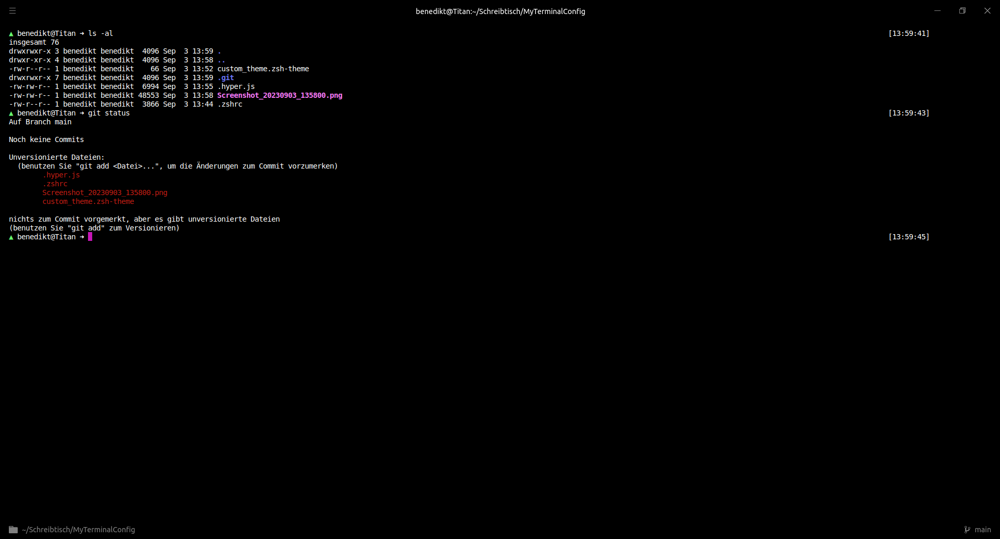

# My terminal config


## Installation

### Components
- [Zsh](https://www.zsh.org/)
- [Oh-My-Zsh](https://github.com/ohmyzsh/ohmyzsh)
- [Hyper](https://github.com/vercel/hyper/releases)
- [Hyper-statusline](https://github.com/henrikruscon/hyper-statusline)

### Install
```bash
git clone https://github.com/Dev-Paxton/MyTerminalConfig.git
cd MyTerminalConfig
./setup.sh
```